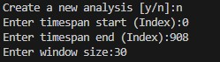
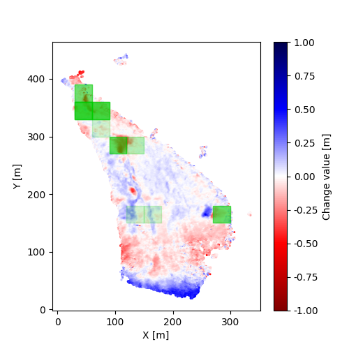
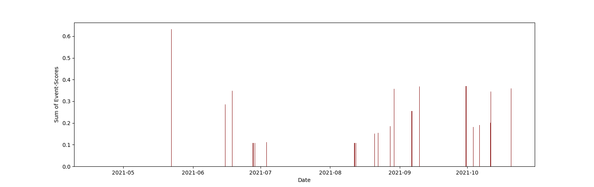
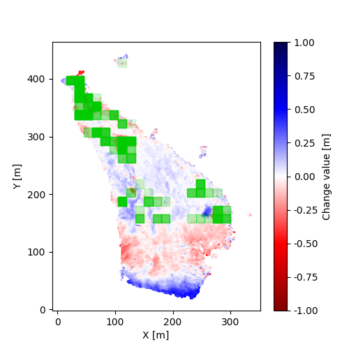
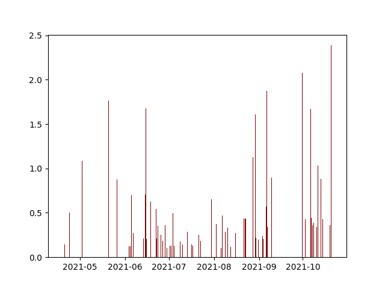

# Komplexpraktikum Photogrammetrie

## Aufgabe
Prozesserkennung in mehrdimensionalen Daten aus Erosionsmessungen (z.B. Boden/Steilhänge) mittels KI-basiertem Clustering (o.ä.)


## Ausgangspunkt
- vorverarbeitete Punktwolken (909 Stück; registriert, orientiert, Distanzen berechnet)
- Photogrammetrisch aufgenommen
- Riverbank des Pulmanki River

Ausgangspunkt der Arbeit sind 909 Punktwolken, die photogrammetrisch aufgenommen wurden. Im vorraus wurden die Punktwolken bereits registriert und zueinander orientiert. Außerdem wurden die Distanzen zwischen den Punktwolken berechnet und diese gerastert in einem Array zur Verfügung gestellt. 

## Ziel 
- 4D change detection
- Zeitliche und räumliche Erkennung und Klassifizierung der Events (Rutschungsereignisse auf dem Steilufer)

Ziel der Arbeit ist die Detektion und Klassifikation von Veränderungen an dem Steilufer. Da es sich um 4-dimensionale Daten handelt (x,y,z und Zeit) muss eine 4D Änderungsdetektion durchgeführt werden. Dabei müssen sowohl die räumliche als auch die zeitliche Ausdehnung der Events erkannt und klassifiziert werden.

## Ansatz
- nutzen der [py4dgeo Bibliothek](https://github.com/3dgeo-heidelberg/py4dgeo/tree/main) für Ablage der Daten in Analyseobjekt

### Angewendete Vereinfachungen
- es wird nur Abtrag registriert 
- es wird nur der Startzeitpunkt des Ereignisses registriert, nicht die Länge oder Geschwindigkeit
- der untere Bereich bis y-Wert 150 wird nicht berücksichtigt, da der Algorithmus sehr anfällig für Rauschen ist
- die Schwellwerte sind hardcodiert

### Ablauf des Algorithmus

#### 1. Changepoints detektieren
- Patch über das Bild bewegen
- nacheinander die gesamte Zeitreihe eines Patches untersuchen
    - Pixel kleiner als Höhenschwellwert/Gesamtpixel des Patches >= Auftrittsschwellwert 
    - & deutliche Höhenänderung zu vorherigem Abtragswert
    - --> Changepoint 
    ```
    # register changepoints
    if((number_values_below/len(image))>=occurence_threshold and
    (number_values_below-number_values_below_old)/len(image)>=occurence_threshold/2):
        changepoints.append([imageindex, height])
    ```

Im ersten Schritt des Algotihmus, werden die Änderungspunkte detektiert. Dazu wird ein quadratischer Patch (Fenster) über das Bild bewegt. Für jede Position wird die gesamte Zeitreihe des Patches untersucht. In jedem Patch aus der Zeitreihe werden die Pixel, die kleiner als der festgelegte Höhenschwellwert sind gezählt, durch die gesamten Pixel im Patch geteilt und in einem Array gespeichert (--> WErte zwischen 0 und 1).  Bei einer starken Änderung der Anzahl der Pixel, die kleiner als der Höhenschwellwert sind, wird ein Änderungspunkt angelegt und zusammen mit der Sprunghöhe (Differenz der Pixel Anzahlen aus zwei Patches) zu der Liste hinzugefügt. 

#### 2. Changepoints filtern und bewerten
- Score = Differenz des durchschnittlichen Abtrages vor und nach Changepoint (vom letztem Changepoint bis zum aktuellen und vom aktuellen bis zum nächsten)
- zu niedrige (kleiner als Mittelwertschwellwert) und negative Scores herausfiltern
```
def calc_weighted_mean_difference(number_values_below_list, start, changepoint, end):
    mean_before_cp = statistics.mean(number_values_below_list[0:changepoint])
    mean_after_cp = statistics.mean(number_values_below_list[changepoint:None])
    mean_difference = mean_after_cp-mean_before_cp
    if(mean_difference <= 0):
        return 0
    return mean_difference
```

Im zweiten Schritt werden die Änderungspunkte aus der Liste mit einer Bewertung versehen und anhand dieser gefiltert. Als Score dient die Differenz der Durchschnitte der Pixelanzahlen kleiner als der Höhenschwellwert bis zum vorherigen und bis zum nachfolgenden Änderungspunkt. 
Angenommen man hat 2 Änderungspunkte registriert. Einen bei Zeitpunkt 20 und einen bei Zeitpunkt 40 von 100. Für den ersten Änderungspunkt wird der Score folgendermaßen berechnet: 

(Durchschnitt der Pixelanzahlen kleiner als der Höhenschwellwert von Zeitpunkt 0 bis 19) - (Durchschnitt der Pixelanzahlen kleiner als der Höhenschwellwert von Zeitpunkt 20 bis 39)

Die "Pixelanzahlen kleiner als der Höhenschwellwert" werden aus der Liste entnommen, die bei der Registrierung angelegt wurde. 
Der Score befindet sich im Bereich zwischen 0 und 1.

Nachdem die beiden Schritte für einen Patch abgeschlossen wurden, wird mit dem nächsten Patch auf gleiche Weise fortgsetzt.

## Programm

### Anforderungen:

- Python 3.11.5
- py4dgeo (https://github.com/3dgeo-heidelberg/py4dgeo/)
```
pip install -r requirements.txt
```
oder
```
pip install py4dgeo
```

- "4dfilt.npy" muss im gleichen Ordner wie das Programm liegen
- bei der ersten Ausführung muss ein neues Analyseobjekt erstellt werden 

### Ausführung
```
python .\minimalversion.py
```
- Eingabe der Parameter
    1. Neue Analyse erstellen (ja/nein) 
    2. Start- und End-Frame der Zeitreihe (max. 908)
    3. Größe des quadratischen Patches (Kantenlänge in Pixel), welches über das Bild geschoben wird

    
- Ausgabe
    1. Bild mit Übersicht der räumlichen Änderungen (Score bestimmt Farbintensität)
    2. Diagramm mit Übersicht der zeitlichen Änderungen (Score bestimmt Höhe des Balkens)
    3. Liste mit Changepoints sortiert nach Score (in der Konsole)

    Die Ausgabe der räumlichen Änderungen basiert auf der eingegebenen Patchgröße und zeigt die Patches, in denen starke Änderungen detektiert wurden grün eingefärbt. Die Intensität/Transparenz der grünen Färbung richtet sich nach dem Score der Änderungspunkte in dem jeweiligen Patch. Ein Intensives grün steth für einen hohen Score und ein tranparentes grün für einen niedrigen Score. Wurden in einem Patch mehrere Änderungspunkte erkannt, so werden die Scores der einzelnen Änderungspunkte aufsummiert. Somit ist erkennbar, in welchen Bereichen viele oder große Events aufgetreten sind.

    Ähnliches gilt für die zeitliche Ausgabe, wo dei Scores die Höhe des Balkens bestimmen. Wurden zu einem Zeitpunkt mehrere Änderungspunkte detektiert, werden auch hier die Scores aufsummiert. In der Ausgabe ist erkennbar, zu welchen Zeitpunkten viele oder große Events aufgetreten sind. 

    Zusätzlich wird die zugrunde liegende Liste der Änderungspunkte mit den jeweiligen Scores, Positionen und Daten in der Konsole ausgegeben.
## Beispiele
- Bemerkung: Pixel bis y-Wert 150 wurde nicht berücksichtigt, da zu starkes Rauschen in diesem Bereich

### B1: Gesamte Zeitreihe; Patchgröße 30x30 Pixel


Räumliche Ausgabe



Zeitliche Ausgabe

### B1: Gesamte Zeitreihe; Patchgröße 15x15 Pixel


Räumliche Ausgabe



Zeitliche Ausgabe

## Ergebnisanalyse und Bewertung der Qualität der Detektion

Der Algorithmus detektiert die Änderungen im Bereich ab y=150 gut. Die im Video deutlich erkennbaren Events werden detektiert. Die Einstellung der Patchgröße hat einen Einfluss auf die Laufzeit und auf die Feingranularität der Ergebnisse. 

Bei der Größe 30x30 Pixel, wurden keine falschen Events erkannt. 

Bei kleineren Patchgrößen werden zwar auch schlechter erkennbare Events detektier. Allerdings werden auch Änderungen erkannt, obwohl es kein Event in diesem Bereich gab.

Bei größeren Patchgrößen, werden nicht mehr alle deutlich sichtbaren Events detektiert. 

Bezüglich der zeitlichen Detektion der Events wurde festgestellt, dass die Events mit einem kleinen Versatz detektiert werden. Das liegt daran, dass die Events mit geringen Änderungen beginnen und der ALgorithmus nur die größte Änderungsamplitude registriert. 

Als Fazit lässt sich festhalten, dass der Algorithmus mit der Einstellung von 30x30 Pixel über den gesamten Zeitraum ein zufriedenstellendes Ergebnis liefert. 


## Offene Aufgaben:
-	Registrierung der Changepoints verbessern (aktuelle mit Vergleich zw. Zwei Zeitpunkten --> mehr mit einschließen)
-	Rauschen im unteren Bereich behandeln
- bessere Evaluation der Ergebnisse
- Ereignislänge bestimmen

