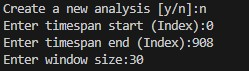
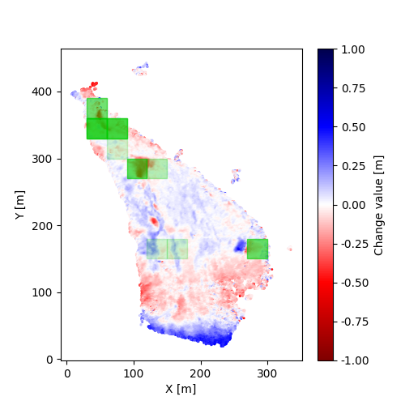
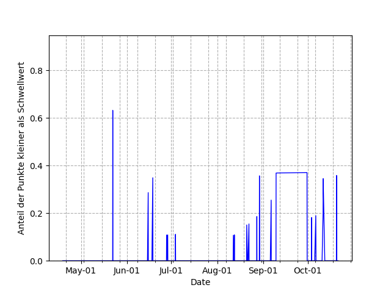
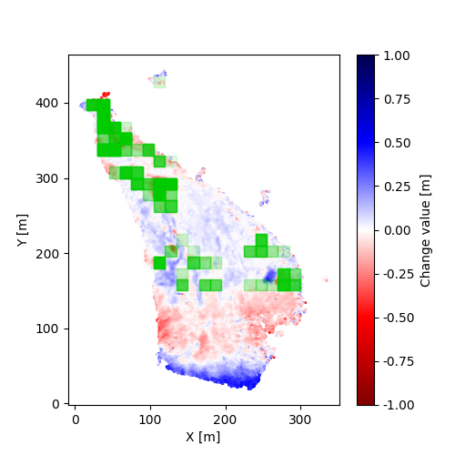
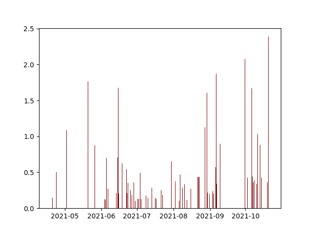

# Komplexpraktikum Photogrammetrie

## Aufgabe
Prozesserkennung in mehrdimensionalen Daten aus Erosionsmessungen (z.B. Boden/Steilhänge) mittels KI-basiertem Clustering (o.ä.)


## Ausgangspunkt
- vorverarbeitete Punktwolken (909 Stück; registriert, orientiert, Distanzen berechnet)
- Photogrammetrisch aufgenommen
- Riverbank des Pulmanki River

## Ziel 
- 4D change detection
- Zeitliche und räumliche Erkennung und Klassifizierung der Events (Rutschungsereignisse auf dem Steilhang)

## Ansatz
- nutzen der [py4dgeo Bibliothek](https://github.com/3dgeo-heidelberg/py4dgeo/tree/main) für Ablage der Daten in Analyseobjekt

### Angewendete Vereinfachungen
- nur Abtrag registrieren
- nur Startzeitpunkt des Ereignisses registrieren, keine Länge oder Geschwindigkeit
- unteren Bereich bis y-Wert 150 nicht berücksichtigen
- hardcodierte Schwellwerte

### Ablauf des Algorithmus

#### 1. Changepoints detektieren
- Patch über das Bild bewegen
- nacheinander die gesamte Zeitreihe eines Patches untersuchen
    - Pixel kleiner als Höhenschwellwert/Gesamtpixel des Patches >= Auftrittsschwellwert 
    - & deutliche Höhenänderung zu vorherigem Abtragswert
    - --> Changepoint 
    ```
    # register changepoints
    if((number_values_below/len(image))>=occurence_threshold and
    (number_values_below-number_values_below_old)/len(image)>=occurence_threshold/2):
        changepoints.append([imageindex, height])
    ```
#### 2. Changepoints filtern und bewerten
- Score = Differenz des durchschnittlichen Abtrages vor und nach Changepoint (vom letztem Changepoint bis zum aktuellen und vom aktuellen bis zum nächsten)
- zu niedrige (kleiner als Mittelwertschwellwert) und negative Scores herausfiltern
```
def calc_weighted_mean_difference(number_values_below_list, start, changepoint, end):
    mean_before_cp = statistics.mean(number_values_below_list[0:changepoint])
    mean_after_cp = statistics.mean(number_values_below_list[changepoint:None])
    mean_difference = mean_after_cp-mean_before_cp
    if(mean_difference <= 0):
        return 0
    return mean_difference
```

## Installation

### Requierements

- Python 3.11.5
- py4dgeo (https://github.com/3dgeo-heidelberg/py4dgeo/)

```
pip install -r requirements.txt
```

## Benutzung

### Anforderungen:
- "4dfilt.npy" muss im gleichen Ordner wie das Programm liegen
- requirements.txt installieren
- bei der ersten Ausfürhung muss ein neues Analyseobjekt erstellt werden 

### Ausführung
- Eingabe der Parameter
    1. Neue Analyse erstellen (ja/nein)
    2. Start- und End-Frame der Zeitreihe (max. 908)
    3. Größe des quadratischen Patches (Kantenlänge in Pixel), welches über das Bild geschoben wird

    
- Ausgabe
    1. Bild mit Übersicht der räumlichen Änderungen (Score bestimmt Farbintensität)
    2. Diagramm mit Übersicht der zeitlichen Änderungen (Score bestimmt Höhe des Balkens)
    3. Liste mit Changepoints sortiert nach Score

## Beispiele
- Bemerkung: Pixel bis y-Wert 150 wurde nicht berücksichtigt, da zu starkes Rauschen in diesem Bereich

### B1: Gesamte Zeitreihe; Patchgröße 30x30 Pixel


Räumliche Ausgabe



Zeitliche Ausgabe

### B1: Gesamte Zeitreihe; Patchgröße 15x15 Pixel


Räumliche Ausgabe



Zeitliche Ausgabe

## Offene Aufgaben:
-	Registrierung der Changepoints verbessern (aktuelle mit Vergleich zw. Zwei Zeitpunkten --> mehr mit einschließen
-	Rauschen im unteren Bereich behandeln
- bessere Evaluation der Ergebnisse
- Ereignislänge bestimmen

